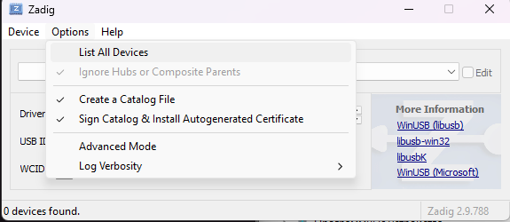
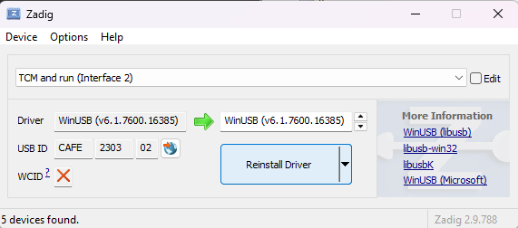

# Информационная часть

В данном разделе будет поэтапно расписана установка и настройка системы для программирования на Windows10/11. 

## Начало

### 1 Установка

Установите данный репозиторий себе <abbr title="Персональный компьютер">**ПК**</abbr>
Рекомендуется через Git
```
git clone https://github.com/Voevodkin-Daniil/BE_U1000_BA_Notes.git
cd BE_U1000_BA_Notes.git
```

### 2 Дальше инструкция согласно pdf

[Открыть PDF-документ](../pdf/BE_U1000_EVU-BA_EVU_LI_start.pdf)

### 3 Дополнительные скриншоты при установке программного обеспечения
Установка драйвера USB через Zadig  
  
  

### 4 Ссылки на программное обеспечение

- SDK для Windows BE-U1000 (версия не ниже 2.1.0) - Уже в проекте(mcu-sdk-windows_2.3.0_20260703)
- Утилита ExtraPuTTY - https://sourceforge.net/projects/extraputty/
- Утилита dfu-util - https://sourceforge.net/projects/dfu-util/files/dfu-util-0.9-win64.zip/download
- Драйвер Virtual COM Port (VCP) - https://ftdichip.com/drivers/vcp-drivers/?__cf_chl_tk=2pbpazXyZIUTYmlzglZPpmzlByWQM8Di8idWTuITUNA-1788511101-1.0.1.1-oE0DuuLO3lxlriuvHmtmqaS4JfhHuPV4_tQI4aUEF_M
- Драйвер WinUSB (устанавливается при помощи утилиты Zadig из состава SDK) - Уже есть в данном проекте. Просто открыть и выполнить установку как в пункте 3